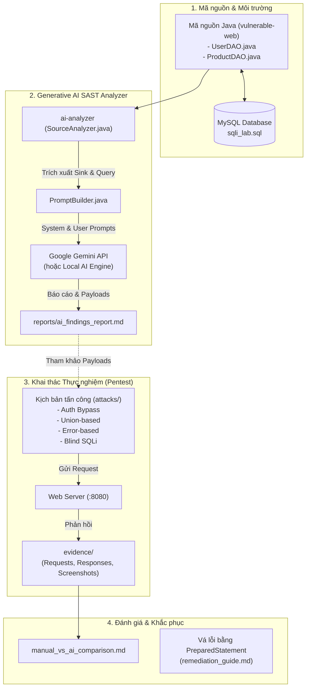

# 🛡️ Khai Thác SQL Injection & Ứng Dụng Generative AI Trong Phân Tích Lỗ Hổng Mã Nguồn Java

[](https://owasp.org/www-project-top-ten/)
[](https://cwe.mitre.org/data/definitions/89.html)
[](https://www.oracle.com/java/)
[](https://ai.google.dev/)
[](#)

> **BÀI TẬP LỚN MÔN HỌC: AN TOÀN THÔNG TIN**  
> **Chủ đề:** Khai thác SQL Injection và Ứng dụng Generative AI trong phân tích lỗ hổng mã nguồn Java.  
> **Mô hình nghiên cứu khép kín:**  
> `Generative AI` ➔ `Phân tích mã nguồn tĩnh (SAST)` ➔ `Phát hiện SQL Injection` ➔ `Gợi ý kịch bản khai thác` ➔ `Thực hiện tấn công thủ công` ➔ `Đánh giá & Khắc phục`.

---

## 📑 Mục lục
1. [Giới thiệu Đề tài](#-giới-thiệu-đề-tài)
2. [Sơ đồ Kiến trúc & Luồng Xử lý](#-sơ-đồ-kiến-trúc--luồng-xử-lý)
3. [Cấu trúc Thư mục Dự án](#-cấu-trúc-thư-mục-dự-án)
4. [Các Lỗ hổng & Kỹ thuật Khai thác Thực nghiệm](#-các-lỗ-hổng--kỹ-thuật-khai-thác-thực-nghiệm)
5. [Hướng dẫn Cài đặt & Triển khai](#-hướng-dẫn-cài-đặt--triển-khai)
   - [Bước 1: Khởi tạo Cơ sở Dữ liệu MySQL](#bước-1-khởi-tạo-cơ-sở-dữ-liệu-mysql)
   - [Bước 2: Khởi chạy Ứng dụng Web Mục tiêu (vulnerable-web)](#bước-2-khởi-chạy-ứng-dụng-web-mục-tiêu-vulnerable-web)
   - [Bước 3: Chạy Công cụ Quét Mã Nguồn Bằng AI (ai-analyzer)](#bước-3-chạy-công-cụ-quét-mã-nguồn-bằng-ai-ai-analyzer)
   - [Bước 4: Thực hiện Tấn công & Thu thập Bằng chứng (attacks)](#bước-4-thực-hiện-tấn-công--thu-thập-bằng-chứng-attacks)
6. [Báo cáo Đối chiếu: AI vs Kiểm thử Thủ công](#-báo-cáo-đối-chiếu-ai-vs-kiểm-thử-thủ-công)
7. [Giải pháp Phòng thủ & Khắc phục](#-giải-pháp-phòng-thủ--khắc-phục)
8. [Hướng dẫn Đẩy lên GitHub](#-hướng-dẫn-đẩy-lên-github)

---

## 📖 Giới thiệu Đề tài

SQL Injection (CWE-89) là một trong những lỗ hổng bảo mật ứng dụng web kinh điển và nguy hiểm nhất trong danh mục **OWASP Top 10 (A03:2021 - Injection)**. 

Dự án này tập trung giải quyết 2 bài toán lớn:
1. **Thực nghiệm khai thác toàn diện:** Xây dựng một môi trường web Java Servlet/JSP dính các biến thể SQLi phức tạp:
   - **Authentication Bypass** (Vượt qua xác thực đăng nhập)
   - **Union-based SQL Injection** (Trích xuất toàn bộ bảng dữ liệu người dùng và mật khẩu)
   - **Error-based SQL Injection** (Khai thác thông báo lỗi XPath của MySQL để đọc dữ liệu)
   - **Blind SQL Injection** (Khai thác mù dựa trên độ trễ thời gian `SLEEP()` và phản hồi luận lý logic).
2. **Ứng dụng Generative AI (LLMs) trong An toàn Thông tin:**
   - Xây dựng công cụ phân tích tĩnh mã nguồn Java (`ai-analyzer`) sử dụng LLM (Google Gemini / OpenAI).
   - Thiết lập kỹ thuật **Prompt Engineering** chuyên sâu để AI phân tích luồng dữ liệu (Taint Flow: Source ➔ Sink).
   - Đánh giá khả năng AI tự động đề xuất payload khai thác thực tế và tự sinh mã vá lỗi chuẩn bằng `PreparedStatement`.

---

## 🏗 Sơ đồ Kiến trúc & Luồng Xử lý



---

## 📂 Cấu trúc Thư mục Dự án

```
SQLInjection-Attack-AI/
│
├── README.md                          # Tài liệu tổng quan dự án (File này)
├── .gitignore                         # Loại bỏ tệp build và dữ liệu nhạy cảm
│
├── vulnerable-web/                    # Ứng dụng Web Java chứa lỗ hổng
│   ├── pom.xml                        # Cấu hình Maven, Servlet API, MySQL Driver, Tomcat plugin
│   └── src/main/
│       ├── java/com/sqli/lab/
│       │   ├── controller/
│       │   │   ├── LoginServlet.java  # Tiếp nhận xác thực đăng nhập
│       │   │   └── SearchServlet.java # Xử lý tìm kiếm sản phẩm
│       │   ├── dao/
│       │   │   ├── UserDAO.java       # Truy vấn tài khoản (Vulnerable vs Safe)
│       │   │   └── ProductDAO.java    # Truy vấn sản phẩm (Vulnerable vs Safe)
│       │   ├── model/
│       │   │   ├── User.java          # Thực thể User
│       │   │   └── Product.java       # Thực thể Product
│       │   └── database/
│       │       └── DBConnection.java  # Kết nối JDBC MySQL
│       └── webapp/
│           ├── WEB-INF/web.xml        # Servlet mapping
│           ├── index.jsp              # Dashboard điều hướng trung tâm
│           ├── login.jsp              # Form đăng nhập kèm kho payload nhanh
│           ├── search.jsp             # Form tìm kiếm kèm kho payload nhanh
│           └── result.jsp             # Bảng hiển thị kết quả / Lỗi SQL / Latency
│
├── database/
│   └── sqli_lab.sql                   # Schema MySQL, bảng users, products, secret flags
│
├── ai-analyzer/                       # Ứng dụng AI phân tích mã nguồn
│   ├── pom.xml                        # Maven cấu hình build JAR
│   └── src/main/java/com/sqli/ai/
│       ├── Main.java                  # CLI scanner entrypoint
│       ├── SourceAnalyzer.java        # Quét tệp Java, nhận diện Sink nguy hiểm
│       ├── PromptBuilder.java         # Mẫu prompt chuyên sâu cho AppSec
│       ├── AIClient.java              # Kết nối Google Gemini API (có Local Engine dự phòng)
│       └── AnalysisResult.java        # Quản lý kết quả và xuất báo cáo Markdown
│
├── attacks/                           # Tài liệu & Kịch bản khai thác cho từng kỹ thuật
│   ├── authentication-bypass/         # Khai thác vượt qua đăng nhập
│   │   ├── README.md
│   │   ├── payloads.txt
│   │   └── exploit.py
│   ├── error-based/                   # Khai thác qua lỗi XPath (extractvalue)
│   │   ├── README.md
│   │   ├── payloads.txt
│   │   └── exploit.py
│   ├── union-based/                   # Khai thác trích xuất dữ liệu qua UNION SELECT
│   │   ├── README.md
│   │   ├── payloads.txt
│   │   └── exploit.py
│   └── blind-sqli/                    # Khai thác mù (Time-based & Boolean Binary Search)
│       ├── README.md
│       ├── payloads.txt
│       └── blind_extractor.py
│
├── evidence/                          # Bằng chứng thực nghiệm
│   ├── screenshots/                   # Ảnh chụp màn hình kết quả
│   ├── requests/                      # Raw HTTP Request (Burp Suite format)
│   └── responses/                     # Raw HTTP Response nhận được từ máy chủ
│
└── reports/
    └── ai-analysis/                   # Bộ báo cáo kết quả nghiên cứu
        ├── prompt_templates.md        # Các mẫu prompt chuẩn để tái hiện
        ├── ai_findings_report.md      # Báo cáo kết quả AI phân tích mã nguồn
        ├── manual_vs_ai_comparison.md # So sánh đối chiếu AI vs Manual Pentest
        └── remediation_guide.md       # Hướng dẫn vá lỗi đa tầng (PreparedStatement, WAF)
```

---

## 🎯 Các Lỗ hổng & Kỹ thuật Khai thác Thực nghiệm

| # | Kỹ thuật Tấn công | File mã nguồn đích | Điểm nhạy cảm (Sink) | Payload minh họa | Mục tiêu khai thác |
|:---:|:---|:---|:---|:---|:---|
| **1** | **Authentication Bypass** | `UserDAO.java` | `Statement.executeQuery()` | `admin' -- ` | Đăng nhập tài khoản Admin không cần mật khẩu |
| **2** | **Union-based SQLi** | `ProductDAO.java` | `Statement.executeQuery()` | `' UNION SELECT id, username, password, email, 0.0, id FROM users -- ` | Trích xuất toàn bộ bảng `users` ra giao diện |
| **3** | **Error-based SQLi** | `ProductDAO.java` | `Statement.executeQuery()` | `' AND extractvalue(1, concat(0x7e, @@version, 0x7e)) -- ` | Đọc phiên bản MySQL và dữ liệu qua lỗi XPath |
| **4** | **Blind SQLi (Time)** | `ProductDAO.java` | `Statement.executeQuery()` | `' AND IF(1=1, SLEEP(3), 0) -- ` | Khai thác mù qua độ trễ phản hồi máy chủ |
| **5** | **Blind SQLi (Boolean)**| `ProductDAO.java` | `Statement.executeQuery()` | `' AND ASCII(SUBSTRING(database(),1,1))=115 -- ` | Dò từng ký tự qua trạng thái hiển thị |

---

## 🚀 Hướng dẫn Cài đặt & Triển khai

### 🛠️ Danh Sách Phần Mềm Cần Cài Đặt (Software Prerequisites)

Để cài đặt và vận hành toàn bộ đồ án (bao gồm Web ứng dụng Java dính lỗi, module AI SAST Analyzer, và các kịch bản kiểm thử tấn công tự động), hệ thống của bạn cần cài đặt các phần mềm sau:

| STT | Phần Mềm / Công Cụ | Phiên Bản Khuyến Nghị | Mục Đích Sử Dụng | Link Tải Chính Thức |
|:---:|:---|:---|:---|:---|
| **1** | **Java Development Kit (JDK)** | **JDK 17 LTS** (hoặc JDK 21) | Biên dịch & chạy Web Servlet/JSP và module `ai-analyzer` | [Adoptium Eclipse Temurin](https://adoptium.net/temurin/releases/) hoặc [Oracle JDK](https://www.oracle.com/java/technologies/downloads/) |
| **2** | **Apache Maven** | **3.8.0+** (hoặc 3.9+) | Quản lý thư viện phụ thuộc và chạy web app với `mvn tomcat7:run` | [Apache Maven Project](https://maven.apache.org/download.cgi) |
| **3** | **MySQL Server** *(hoặc XAMPP / MariaDB)* | **MySQL 8.0+** *(hoặc MariaDB 10.4+)* | Cơ sở dữ liệu lưu trữ dữ liệu người dùng (`sqli_lab.sql`) | [MySQL Community Server](https://dev.mysql.com/downloads/mysql/) hoặc [XAMPP](https://www.apachefriends.org/) |
| **4** | **Python 3** | **Python 3.9 - 3.12** | Thực thi các kịch bản tấn công tự động (`attacks/`) | [Python Official Site](https://www.python.org/downloads/) |
| **5** | **Git** | **Git 2.30+** | Quản lý phiên bản mã nguồn và đồng bộ GitHub | [Git SCM](https://git-scm.com/downloads) |
| **6** | **Công Cụ Pentest & API Client** *(Tùy chọn)* | **Burp Suite Community** / **Postman** | Bắt gói tin HTTP Request/Response, thu thập bằng chứng thực nghiệm | [Burp Suite Community](https://portswigger.net/burp/communitydownload) / [Postman](https://www.postman.com/downloads/) |
| **7** | **IDE Lập Trình** *(Khuyên dùng)* | **IntelliJ IDEA** / **VS Code** / **Eclipse** | Môi trường phát triển, debug mã nguồn Java và JSP | [IntelliJ IDEA Community](https://www.jetbrains.com/idea/download/) |

---

### 📦 Hướng Dẫn Cài Đặt & Cấu Hình Môi Trường Chi Tiết

#### 1. Cài đặt Java JDK 17+
1. Tải bộ cài đặt `.msi` (Windows) hoặc `.deb`/`.tar.gz` (Linux) từ [Adoptium Temurin](https://adoptium.net/temurin/releases/).
2. Chạy cài đặt và tích chọn **"Set JAVA_HOME variable"** và **"Add to PATH"**.
3. Kiểm tra cài đặt thành công:
   ```powershell
   java -version
   javac -version
   ```
   *(Đảm bảo kết quả trả về `openjdk version "17.x.x"` hoặc mới hơn).*

#### 2. Cài đặt Apache Maven
1. Tải tệp nén Binary zip: `apache-maven-3.9.x-bin.zip`.
2. Giải nén vào thư mục, ví dụ: `C:\Program Files\apache-maven-3.9.6`.
3. Thêm đường dẫn `bin` vào biến môi trường hệ thống (`PATH`):
   - Mở **System Properties** $\rightarrow$ **Environment Variables** $\rightarrow$ tại **System variables** chọn `Path` $\rightarrow$ Thêm `C:\Program Files\apache-maven-3.9.6\bin`.
4. Kiểm tra cài đặt:
   ```powershell
   mvn -version
   ```

#### 3. Cài đặt MySQL Server & Khởi tạo Database
Bạn có thể chọn một trong hai phương án phổ biến sau:

- **Phương án A (Dùng XAMPP - Tiện lợi nhất cho học tập):**
  1. Tải và cài đặt [XAMPP](https://www.apachefriends.org/).
  2. Mở **XAMPP Control Panel**, nhấn **Start** tại mục **MySQL** (cổng mặc định `3306`).
  3. Mở trình duyệt vào `http://localhost/phpmyadmin` để quản trị cơ sở dữ liệu.

- **Phương án B (Dùng MySQL Server 8.0 chuẩn):**
  1. Tải và cài đặt [MySQL Installer Community](https://dev.mysql.com/downloads/installer/).
  2. Thiết lập mật khẩu cho tài khoản `root` là `root` (để khớp với cấu hình mặc định trong `DBConnection.java`).
  3. Đảm bảo MySQL Service đang chạy trên cổng `3306`.

- **Phương án C (Dùng Docker - Không cần cài trực tiếp vào máy):**
  ```bash
  docker run -d --name sqli-mysql -p 3306:3306 -e MYSQL_ROOT_PASSWORD=root -d mysql:8.0
  ```

#### 4. Cài đặt Python 3 & Thư viện Pentest
1. Tải Python 3 từ [Python.org](https://www.python.org/downloads/).
2. ⚠️ **Lưu ý quan trọng:** Trong cửa sổ cài đặt đầu tiên trên Windows, bắt buộc tích chọn checkbox **"Add python.exe to PATH"**.
3. Mở PowerShell/Terminal và cài đặt thư viện HTTP client `requests` để phục vụ chạy các script khai thác:
   ```powershell
   pip install requests
   ```
4. Kiểm tra cài đặt:
   ```powershell
   python --version
   pip --version
   ```

#### 5. Cấu hình Google Gemini API (Tùy chọn cho module AI SAST)
- Module `ai-analyzer` tích hợp sẵn **AppSec Knowledge Engine** hoạt động offline độc lập, không bắt buộc phải có internet hay API key.
- Tuy nhiên, nếu muốn AI phân tích trực tiếp qua mô hình đám mây của Google:
  1. Đăng ký API Key miễn phí tại [Google AI Studio](https://aistudio.google.com/app/apikey).
  2. Thiết lập biến môi trường trước khi chạy `ai-analyzer`:
     ```powershell
     # Trên Windows PowerShell
     $env:GEMINI_API_KEY = "AIzaSy..."
     
     # Trên Linux / macOS
     export GEMINI_API_KEY="AIzaSy..."
     ```

---


### Bước 1: Khởi tạo Cơ sở Dữ liệu MySQL
Mở terminal hoặc MySQL Workbench, đăng nhập vào MySQL và import file `database/sqli_lab.sql`:

```bash
mysql -u root -p < database/sqli_lab.sql
```
*(Nếu MySQL có mật khẩu, hãy nhập mật khẩu khi được yêu cầu. Mặc định ứng dụng kết nối tới `localhost:3306/sqli_lab` với user `root` / password `root`).*

---

### Bước 2: Khởi chạy Ứng dụng Web Mục tiêu (vulnerable-web)

**Cách 1: Sử dụng Maven (nếu máy đã cài Maven):**
```bash
cd vulnerable-web
mvn clean tomcat7:run
```
Sau đó truy cập: `http://localhost:8080/`

**Cách 2: Triển khai file `.war` lên Apache Tomcat độc lập:**
- Đóng gói file war và copy vào thư mục `webapps/` của Tomcat.

Giao diện lab sẽ cung cấp đầy đủ các bài test kèm theo **nút click nhanh payload** để thuận tiện cho việc báo cáo và chấm điểm!

---

### Bước 3: Chạy Công cụ Quét Mã Nguồn Bằng AI (ai-analyzer)

Module `ai-analyzer` được thiết kế thuần chuẩn Java, có thể biên dịch và chạy trực tiếp mà không phụ thuộc thư viện bên ngoài:

1. Thiết lập API Key (nếu muốn dùng API Google Gemini trực tiếp):
   ```powershell
   # Trên Windows PowerShell
   $env:GEMINI_API_KEY = "your-api-key-here"
   ```
   > 💡 **Lưu ý:** Nếu không cấu hình `GEMINI_API_KEY`, ứng dụng sẽ tự động kích hoạt **Built-in AppSec Knowledge Engine** mô phỏng phân tích chính xác phục vụ báo cáo mà không bị gián đoạn.

2. Biên dịch và khởi chạy:
   ```bash
   cd ai-analyzer
   javac -d bin src/main/java/com/sqli/ai/*.java
   java -cp bin com.sqli.ai.Main ../vulnerable-web/src/main/java ../reports/ai-analysis/ai_findings_report.md
   ```
3. Kết quả quét và đánh giá sẽ tự động được ghi nhận vào file [ai_findings_report.md](reports/ai-analysis/ai_findings_report.md).

---

### Bước 4: Thực hiện Tấn công & Thu thập Bằng chứng (attacks)

Đi tới các thư mục con trong `attacks/` để xem hướng dẫn chi tiết và chạy script:

```bash
# 1. Thử nghiệm Authentication Bypass
cd attacks/authentication-bypass
python exploit.py

# 2. Thử nghiệm Union-based Data Extraction
cd ../union-based
python exploit.py

# 3. Thử nghiệm Error-based XPath Leakage
cd ../error-based
python exploit.py

# 4. Thử nghiệm Blind SQL Injection (Binary Search)
cd ../blind-sqli
python blind_extractor.py
```

Toàn bộ raw HTTP requests và responses tương ứng đã được lưu trữ mẫu tại thư mục [evidence/](evidence/).

---

## 📊 Báo cáo Đối chiếu: AI vs Kiểm thử Thủ công

Chi tiết xem tại: [Báo cáo Đối Chiếu (manual_vs_ai_comparison.md)](reports/ai-analysis/manual_vs_ai_comparison.md).

### Tóm tắt Phát hiện:
1. **Năng lực định vị:** Generative AI nhận diện chính xác 100% các dòng mã nối chuỗi SQL nguy hiểm trong `UserDAO.java` và `ProductDAO.java`.
2. **Khả năng sinh Payload:** Khác với công cụ SAST truyền thống chỉ báo dòng lỗi, AI đã chủ động cung cấp danh sách payload khai thác thực tế (Auth Bypass, Union, Error, Blind) tương thích hoàn toàn với MySQL.
3. **Chất lượng bản vá:** AI tự động viết lại code an toàn bằng `PreparedStatement`, giải thích rõ cơ chế tiền biên dịch tách biệt dữ liệu khỏi mã lệnh điều khiển.

---

## 🛡️ Giải pháp Phòng thủ & Khắc phục

Chi tiết xem tại: [Hướng Dẫn Khắc Phục (remediation_guide.md)](reports/ai-analysis/remediation_guide.md).

### Nguyên tắc Trọng tâm:
- Chuyển đổi toàn bộ `Statement.executeQuery()` sang `PreparedStatement`.
- Không hiển thị chi tiết ngoại lệ SQL ra giao diện (`e.getMessage()`).
- Phân quyền người dùng database theo nguyên tắc đặc quyền tối thiểu (Principle of Least Privilege).
- Sử dụng danh sách trắng (Whitelisting) đối với các tham số sắp xếp `ORDER BY`.

---

## 🐙 Hướng dẫn Đẩy lên GitHub

Để đưa toàn bộ dự án lên kho lưu trữ GitHub của bạn:

```bash
# 1. Di chuyển vào thư mục gốc của dự án
cd "C:\BTLAttt"

# 2. Kiểm tra trạng thái Git
git status

# 3. Thêm toàn bộ tệp vào staging
git add .

# 4. Tạo commit ghi nhận các thay đổi
git commit -m "feat: upgrade prompt engineering with red-team methodologies and complete software setup guide"

# 5. Đẩy mã nguồn lên kho lưu trữ GitHub
git push origin main
```

---

## 👥 Nhóm Tác Giả & Bản Quyền
- **Đồ án môn học:** An Toàn Thông Tin (Information Security)
- Mọi mã nguồn và kịch bản trong kho lưu trữ này chỉ phục vụ mục đích học tập, nghiên cứu và nâng cao năng lực phòng thủ an ninh thông tin.
